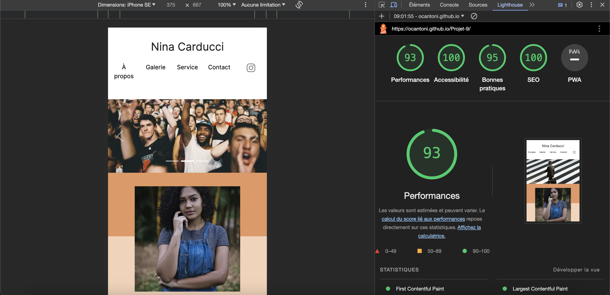

<h1>Nina Carducci Projet 9</h1>

9ème projet du parcours "Intégrateur web" avec Openclassrooms. Optimiser le référencement, l'accéssibilité, et les performances d'une page web existante.Mise en avant sur le <b>S E O</b>, l'optimisation pour les moteurs de recheches et donc le référencement naturel. La cliente à pour objecif grace à ces modifications, un chargement plus rapide de sa page, gains de visiteurs et donc d'activitées, meilleur référencement de sa page.

<h2>Apercu du projet</h2>

<h2>Axes de travail</h2>

Balises sémantiques, images responsives, schema.org ... 

<h2>Liens</h2>

Vous pouvez retrouver le lien de la version finale --> <a href="https://ocantoni.github.io/Projet-9/"> ici</a>